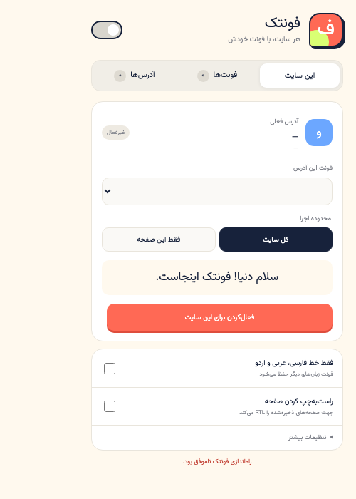

# فونتک

فونتک یک کتابخانه فونت محلی برای Chrome است. فونت وزیرمتن از ابتدا داخل افزونه قرار دارد و فونت پیش‌فرض نصب تازه است؛ همچنین می‌توانید چند فایل فونت اضافه کنید و برای هر سایت یا هر صفحه، فونت متفاوتی انتخاب کنید. تا وقتی آدرسی را خودتان به فهرست اضافه نکرده باشید، افزونه هیچ تغییری در آن ایجاد نمی‌کند.

[دانلود آخرین نسخه](https://github.com/Goodrich347/fontak/releases/latest/download/fontak.zip) · [گزارش مشکل](https://github.com/Goodrich347/fontak/issues) · [سیاست حریم خصوصی](https://goodrich347.github.io/fontak/PRIVACY.html)

## نصب یا به‌روزرسانی

### نصب تمیز نسخه پایدار 2.5.0

1. نسخه‌های قبلی فونتک را از `chrome://extensions` حذف کنید.
2. Chrome را کاملاً ببندید و دوباره باز کنید.
3. فایل `fontak-v2.5.0-stable.zip` را از حالت ZIP خارج کنید.
4. در `chrome://extensions`، گزینه **Developer mode** را روشن کنید.
5. روی **Load unpacked** بزنید و پوشه `fontak-v2.5.0-stable` را انتخاب کنید.

شناسه این شاخه از نسخه `2.5.0` ثابت است. برای به‌روزرسانی‌های بعدی، فایل‌های جدید را در همین پوشه جایگزین کنید و فقط **Reload** همان کارت را بزنید؛ افزونه را دوباره با **Load unpacked** اضافه نکنید.

### روش عمومی

1. فایل `fontak.zip` را از بخش [Releases](https://github.com/Goodrich347/fontak/releases/latest) دانلود و از حالت ZIP خارج کنید.
2. آدرس `chrome://extensions` را باز کنید.
3. **Developer mode** را روشن کنید.
4. برای نصب تازه، روی **Load unpacked** بزنید و پوشه `fontak` را انتخاب کنید.
5. اگر نسخه قبلی نصب است، **Load unpacked را دوباره نزنید**. فایل‌های نسخه جدید را داخل همان پوشه قبلی جایگزین کنید و روی دکمه **Reload** همان کارت افزونه بزنید. Chrome تنظیمات افزونه unpacked را با شناسه‌ای نگه می‌دارد که به همان نصب و مسیر وابسته است.

> اگر نسخه جدید را از پوشه دیگری با **Load unpacked** اضافه کنید، Chrome ممکن است آن را افزونه‌ای جدا ببیند و تنظیمات قبلی در آن نمایش داده نشوند. تا وقتی افزونه قدیمی را Remove نکرده باشید، داده‌های آن معمولاً روی همان کارت قدیمی باقی می‌مانند.

فونت انتخاب‌شده در نسخه قبلی، در اولین اجرای نسخه ۲ به کتابخانه فونتک منتقل می‌شود؛ اما هیچ قانون سراسری ساخته نمی‌شود.

## استفاده

### افزودن فونت

فونت «وزیرمتن» به‌صورت داخلی آماده است و حذف نمی‌شود. در ارتقا از نسخه قبلی، انتخاب فعلی شما حفظ می‌شود؛ اگر قبلاً فونت پیش‌فرضی نداشته باشید، وزیرمتن انتخاب می‌شود.

1. از تب «فونت‌ها» روی «افزودن فونت» بزنید.
2. یک یا چند فایل `WOFF2`، `WOFF`، `TTF` یا `OTF` انتخاب کنید.
3. هر فایل می‌تواند حداکثر ۱۰ مگابایت باشد. داده فونت فقط در فضای محلی افزونه ذخیره می‌شود.

فقط فونت‌هایی را وارد کنید که مجوز استفاده از آن‌ها را دارید. فونتک هیچ فایل فونت بارگذاری‌شده‌ای را منتشر یا برای توسعه‌دهنده ارسال نمی‌کند.

### فعال‌کردن برای یک آدرس

1. سایت موردنظر را باز کنید و روی آیکن فونتک بزنید.
2. در تب «این سایت» فونت را انتخاب کنید.
3. یکی از محدوده‌ها را انتخاب کنید:
   - **کل سایت:** قانون روی تمام صفحه‌های همان دامنه اجرا می‌شود.
   - **فقط این صفحه:** قانون روی همان مسیر URL اجرا می‌شود و Query String یا Fragment نادیده گرفته می‌شود.
4. روی «فعال‌کردن برای این سایت» بزنید.

در همین لحظه Chrome اجازه دسترسی فقط به همان سایت را درخواست می‌کند. فونتک هنگام نصب، دسترسی سراسری به همه سایت‌ها نمی‌گیرد. اگر از نسخه آزمایشی قدیمی ارتقا داده‌اید و کنار یک قانون «نیاز به اجازه» می‌بینید، همان دکمه را یک‌بار بزنید.

قانون صفحه خاص بر قانون کل سایت اولویت دارد. تب «آدرس‌ها» تمام قوانین ذخیره‌شده و فونت هرکدام را نشان می‌دهد.

## تنظیمات

- **فقط خط فارسی، عربی و اردو:** فونت جدید فقط برای محدوده‌های Unicode خط عربی استفاده می‌شود و فونت نویسه‌های زبان‌های دیگر از طراحی اصلی سایت گرفته می‌شود.
- **راست‌به‌چپ کردن صفحه:** جهت صفحه‌های موجود در فهرست را `RTL` می‌کند.
- **دسترسی یک‌باره به همه سایت‌ها:** با یک تأیید Chrome، سؤال مجوز جداگانه برای سایت‌های بعدی حذف می‌شود. فونتک همچنان فقط آدرس‌هایی را تغییر می‌دهد که خودتان در فهرست ذخیره کرده‌اید.
- **حفاظت از آیکون‌ها:** از خراب‌شدن Material Icons، Font Awesome و الگوهای رایج جلوگیری می‌کند.
- **حفظ فونت کدها:** عناصر `code`، `pre`، `kbd` و `samp` را تغییر نمی‌دهد.
- کلید بالای popup تمام قوانین را موقتاً متوقف یا دوباره فعال می‌کند.

## سازگاری با سایت‌های پویا

موتور فونتک DOM را به‌صورت تکه‌ای و در زمان بیکاری مرورگر پردازش می‌کند؛ بنابراین فعال‌کردن فونت یا دریافت پیام‌های تازه نباید thread اصلی صفحه را با یک پیمایش هم‌زمان قفل کند. تغییرات جدید صفحه نیز به‌صورت صف‌بندی‌شده و بدون Reload اعمال می‌شوند.

برای سایت‌های پرتحرک شامل Gmail، Google Docs، YouTube، ChatGPT، Gemini، Slack، WhatsApp Web، Telegram Web، X، LinkedIn و Discord بودجه پردازش محافظه‌کارانه‌تری در نظر گرفته شده است. محافظت عمومی همچنان روی سایت‌های مشابهی که محتوای خود را زنده تغییر می‌دهند اجرا می‌شود.

## محدودیت‌های Chrome

- افزونه‌ها روی `chrome://`، Chrome Web Store و بعضی viewerهای داخلی اجرا نمی‌شوند.
- متن رسم‌شده روی Canvas یا داخل تصویر/PDF با CSS قابل تغییر نیست.
- Shadow DOMهای باز و iframeهای هم‌مبدأ پشتیبانی می‌شوند؛ Shadow DOM بسته و iframeهای بدون مجوز از دسترس افزونه خارج‌اند.
- RTL اجباری جهت ریشه صفحه و ویرایشگرهای متنی را تغییر می‌دهد، اما برای جلوگیری از کندی یا خرابی برنامه‌هایی مثل Gmail روی تک‌تک عناصر style درون‌خطی نمی‌نویسد. سایت‌هایی که فقط از مقادیر فیزیکی `left` و `right` استفاده کرده‌اند همچنان ممکن است چیدمان متفاوتی نشان دهند.

## مجوز فونت رابط

رابط فونتک از [Vazirmatn](https://github.com/rastikerdar/vazirmatn) نسخه `33.003` استفاده می‌کند. این فونت تحت SIL Open Font License 1.1 منتشر شده و متن کامل مجوز در `assets/Vazirmatn-OFL.txt` قرار دارد.
